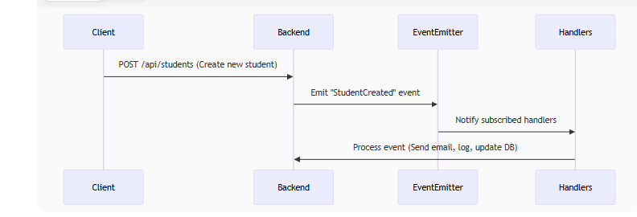

# Exposing and Handling Events

1. Introduction
Event-Driven Architecture (EDA) is a software architecture paradigm that relies on producing, detecting, and reacting to events. In a Student Management System, events such as:

- Student course registration
- Grade updates
- Changes in academic status

can be efficiently managed using an event-driven approach.

This report explains the implementation of Exposing and Handling Events in a system using Node.js/TypeScript (Backend) and React (Frontend).

## 2. Event-Driven Architecture in the System

### 2.1. Workflow


### 2.2. Key Components

| Component      | Description                                              |
| ------------- | -------------------------------------------------------- |
| Event Emitter | Detects and dispatches events (using EventEmitter3 or RxJS) |
| Event Handlers| Services that listen and react to events (email, logging, analytics) |
| Event Store   | Stores event history (using MongoDB/Redis)               |

## 3. Backend Implementation (Node.js/TypeScript)

### 3.1. Defining Events
```typescript
// events/student.events.ts
export class StudentCreatedEvent {
  constructor(
    public readonly studentId: string,
    public readonly email: string
  ) {}
}

export class GradeUpdatedEvent {
  constructor(
    public readonly studentId: string,
    public readonly courseId: string,
    public readonly newGrade: number
  ) {}
}
```

### 3.2. Emitting Events from Services
```typescript
// services/student.service.ts
import { EventEmitter } from 'eventemitter3';

export class StudentService {
  constructor(private eventEmitter: EventEmitter) {}

  async createStudent(studentData: CreateStudentDto) {
    const student = await this.studentRepository.save(studentData);

    // Emit event
    this.eventEmitter.emit(
      'StudentCreated',
      new StudentCreatedEvent(student.id, student.email)
    );

    return student;
  }
}
```

### 3.3. Handling Events
```typescript
// handlers/email.handler.ts
eventEmitter.on('StudentCreated', (event: StudentCreatedEvent) => {
  console.log(`Sending welcome email to ${event.email}`);
  // EmailService.sendWelcomeEmail(...)
});

// handlers/analytics.handler.ts
eventEmitter.on('GradeUpdated', (event: GradeUpdatedEvent) => {
  console.log(`Updating GPA for student ${event.studentId}`);
  // AnalyticsService.updateGPA(...)
});
```

## 4. Frontend Implementation (React)

### 4.1. Using Custom Events (If Needed)
```javascript
// In StudentForm component (after successful submission)
const handleSubmit = async () => {
  const response = await api.createStudent(formData);

  // Dispatch custom event
  window.dispatchEvent(
    new CustomEvent('StudentCreated', { detail: response.data })
  );
};

// Listening in another component
useEffect(() => {
  const handler = (e) => console.log('New student:', e.detail);
  window.addEventListener('StudentCreated', handler);
  return () => window.removeEventListener('StudentCreated', handler);
}, []);
```

## 5. Benefits

| Benefit            | Description                                               |
|--------------------|-----------------------------------------------------------|
| Loose Coupling     | Modules communicate via events instead of direct calls     |
| Extensibility      | New handlers can be added without modifying existing code  |
| Asynchronous Processing | Decouples core logic from side tasks (email, logging) |
| Testability        | Easy to mock events for isolated handler testing           |

## 6. Future Improvements

### 6.1. Event Sourcing
- Store all events as the single source of truth.
- Use cases: Audit logging, Event replay for debugging.

### 6.2. Message Queue (Kafka/RabbitMQ)
- Ensure reliable event processing in distributed systems.
- Use cases: Scalability, Retry mechanisms for failed events.

### 6.3. Webhooks Integration
- Allow external systems to subscribe to events.

## 7. Conclusion

Implementing Exposing and Handling Events provides:

- Flexibility when adding new features
- Maintainability by reducing component dependencies
- High Performance through asynchronous processing

**Recommendations:**
- Use EventEmitter3 or RxJS for complex event flows.
- Implement Event Store if historical tracking is required.