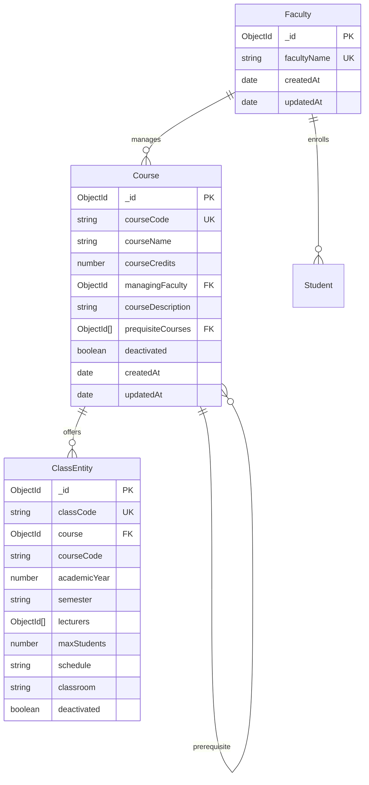
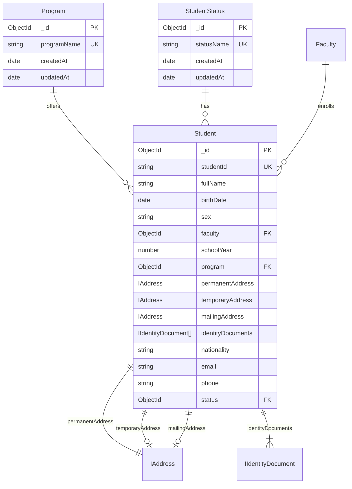
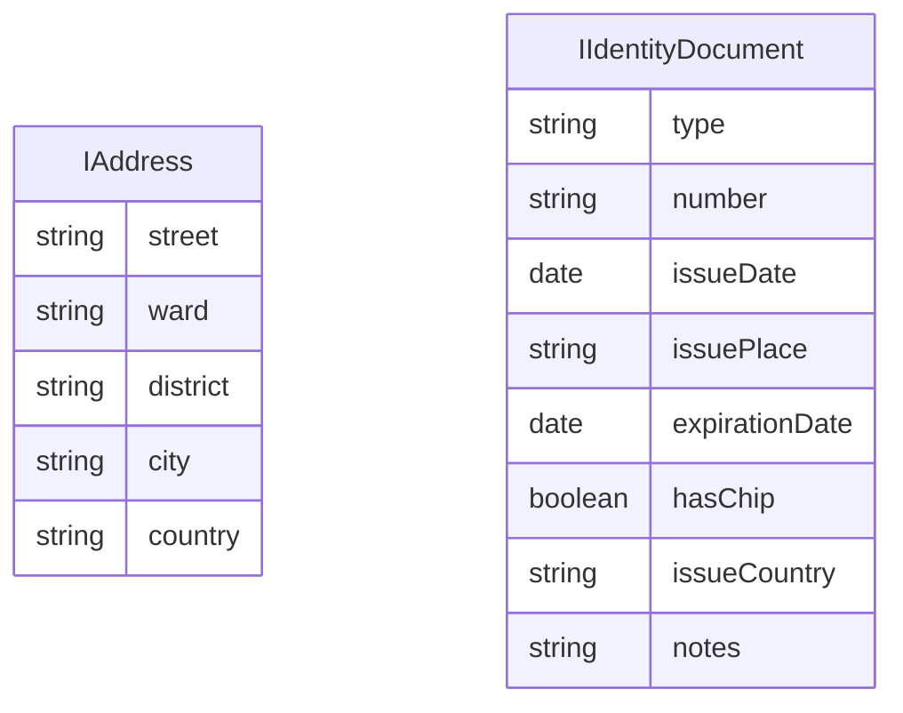
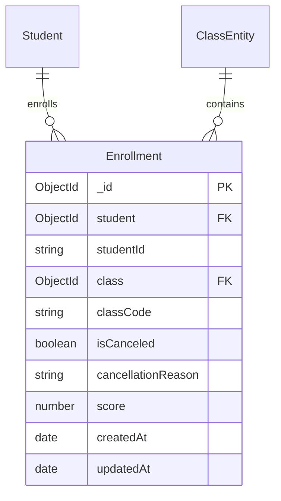

# Database Schema Documentation

([_Return to index_](index.md))

## Overview

This document provides comprehensive documentation for the Student Management System database schema. The system uses MongoDB as the primary database with Mongoose ODM for TypeScript integration.

## Database Technology Stack

- **Database**: MongoDB (NoSQL)
- **ODM**: Mongoose with TypeScript
- **Migration**: Custom migration system with `migrate-mongo`
- **Testing**: Vitest with MongoDB Memory Server

## Collections Overview

The system consists of 7 main collections organized into three logical groups:

1. **Course and Faculty Management**: Faculty, Course, Class
2. **Student Management System**: Program, StudentStatus, Student
3. **Enrollment System**: Enrollment

## Entity Relationship Diagrams

### Course and Faculty Management



### Student Management System



### Embedded Schema Types



### Enrollment System



## Collection Schemas

### Faculty Collection

**Collection Name**: `faculties`

| Field         | Type     | Constraints      | Description                      |
| ------------- | -------- | ---------------- | -------------------------------- |
| `_id`         | ObjectId | Primary Key      | Auto-generated unique identifier |
| `facultyName` | String   | Required, Unique | Name of the faculty/department   |
| `createdAt`   | Date     | Auto-generated   | Record creation timestamp        |
| `updatedAt`   | Date     | Auto-generated   | Last modification timestamp      |

**Indexes**:

- Primary: `_id`
- Unique: `facultyName`

**Sample Document**:

```json
{
  "_id": "60b8b6e3e6d9e431f4a23b1a",
  "facultyName": "Faculty of Law",
  "createdAt": "2024-03-20T08:00:00.000Z",
  "updatedAt": "2024-03-20T08:00:00.000Z"
}
```

### Program Collection

**Collection Name**: `programs`

| Field         | Type     | Constraints      | Description                      |
| ------------- | -------- | ---------------- | -------------------------------- |
| `_id`         | ObjectId | Primary Key      | Auto-generated unique identifier |
| `programName` | String   | Required, Unique | Name of the academic program     |
| `createdAt`   | Date     | Auto-generated   | Record creation timestamp        |
| `updatedAt`   | Date     | Auto-generated   | Last modification timestamp      |

**Indexes**:

- Primary: `_id`
- Unique: `programName`

**Sample Document**:

```json
{
  "_id": "60b8b6e3e6d9e431f4a23b1b",
  "programName": "Bachelor of Law",
  "createdAt": "2024-03-20T08:00:00.000Z",
  "updatedAt": "2024-03-20T08:00:00.000Z"
}
```

### StudentStatus Collection

**Collection Name**: `studentstatuses`

| Field        | Type     | Constraints      | Description                      |
| ------------ | -------- | ---------------- | -------------------------------- |
| `_id`        | ObjectId | Primary Key      | Auto-generated unique identifier |
| `statusName` | String   | Required, Unique | Student academic status          |
| `createdAt`  | Date     | Auto-generated   | Record creation timestamp        |
| `updatedAt`  | Date     | Auto-generated   | Last modification timestamp      |

**Valid Status Values**:

Based on the migration `20250321-create-studentstatuses.js`, the system initializes with these status values:

- "Active"
- "Graduated"
- "Dropped Out"
- "Paused"

_Note: Additional status values can be added through the application interface or database migrations as needed._

**Indexes**:

- Primary: `_id`
- Unique: `statusName`

**Sample Document**:

```json
{
  "_id": "60b8b6e3e6d9e431f4a23b1c",
  "statusName": "Active",
  "createdAt": "2024-03-21T08:00:00.000Z",
  "updatedAt": "2024-03-21T08:00:00.000Z"
}
```

### Course Collection

**Collection Name**: `courses`

| Field               | Type            | Constraints              | Description                             |
| ------------------- | --------------- | ------------------------ | --------------------------------------- |
| `_id`               | ObjectId        | Primary Key              | Auto-generated unique identifier        |
| `courseCode`        | String          | Required, Unique         | Course identification code              |
| `courseName`        | String          | Required                 | Full name of the course                 |
| `courseCredits`     | Number          | Required, Min: 2         | Number of academic credits              |
| `managingFaculty`   | ObjectId        | Required, FK → Faculty   | Reference to managing faculty           |
| `courseDescription` | String          | Required                 | Detailed course description             |
| `prequisiteCourses` | Array<ObjectId> | Optional, FK → Course    | Array of prerequisite course references |
| `deactivated`       | Boolean         | Optional, Default: false | Course deactivation status              |
| `createdAt`         | Date            | Auto-generated           | Record creation timestamp               |
| `updatedAt`         | Date            | Auto-generated           | Last modification timestamp             |

**Validation Rules**:

- `courseCredits`: Minimum value of 2
- `managingFaculty`: Must reference existing Faculty document
- `prequisiteCourses`: All ObjectIds must reference existing Course documents

**Indexes**:

- Primary: `_id`
- Unique: `courseCode`
- Foreign Key: `managingFaculty`

**Sample Document**:

```json
{
  "_id": "60b8b6e3e6d9e431f4a23b1d",
  "courseCode": "LAW101",
  "courseName": "Introduction to Law",
  "courseCredits": 3,
  "managingFaculty": "60b8b6e3e6d9e431f4a23b1a",
  "courseDescription": "An introductory course to the basics of law.",
  "prequisiteCourses": [],
  "deactivated": false,
  "createdAt": "2024-04-18T08:00:00.000Z",
  "updatedAt": "2024-04-18T08:00:00.000Z"
}
```

### Class Collection

**Collection Name**: `classes`

| Field          | Type            | Constraints                      | Description                                    |
| -------------- | --------------- | -------------------------------- | ---------------------------------------------- |
| `_id`          | ObjectId        | Primary Key                      | Auto-generated unique identifier               |
| `classCode`    | String          | Required, Unique                 | Class identification code                      |
| `course`       | ObjectId        | Optional, FK → Course            | Auto-populated course reference                |
| `courseCode`   | String          | Required, FK → Course.courseCode | Reference to course by code                    |
| `academicYear` | Number          | Required                         | Academic year (e.g., 2024)                     |
| `semester`     | String          | Required, Enum                   | Semester ("I", "II", "III")                    |
| `lecturers`    | Array<ObjectId> | Required                         | Array of lecturer references (currently empty) |
| `maxStudents`  | Number          | Required                         | Maximum enrollment capacity                    |
| `schedule`     | String          | Required                         | Class schedule information                     |
| `classroom`    | String          | Required                         | Classroom location                             |
| `deactivated`  | Boolean         | Optional, Default: false         | Class deactivation status                      |

**Validation Rules**:

- `courseCode`: Must reference existing Course document
- `semester`: Must be one of "I", "II", "III"
- `maxStudents`: Must be positive number

**Indexes**:

- Primary: `_id`
- Unique: `classCode`
- Foreign Key: `course`

**Unused/Future Properties**:

- `lecturers`: Currently empty array, reserved for future lecturer assignment functionality
- `deactivated`: Present but not used in current business logic

**Sample Document**:

```json
{
  "_id": "60b8b6e3e6d9e431f4a23b1e",
  "classCode": "LAW101_01",
  "course": "60b8b6e3e6d9e431f4a23b1d",
  "courseCode": "LAW101",
  "academicYear": 2024,
  "semester": "I",
  "lecturers": [],
  "maxStudents": 50,
  "schedule": "Mon-Wed 9:00-11:00",
  "classroom": "A101",
  "deactivated": false
}
```

### Student Collection

**Collection Name**: `students`

| Field               | Type                     | Constraints                  | Description                        |
| ------------------- | ------------------------ | ---------------------------- | ---------------------------------- |
| `_id`               | ObjectId                 | Primary Key                  | Auto-generated unique identifier   |
| `studentId`         | String                   | Required, Unique             | Student identification number      |
| `fullName`          | String                   | Required                     | Student's full name                |
| `birthDate`         | Date                     | Required                     | Date of birth                      |
| `sex`               | String                   | Required, Enum               | Gender ("male", "female", "other") |
| `faculty`           | ObjectId                 | Required, FK → Faculty       | Reference to student's faculty     |
| `schoolYear`        | Number                   | Required                     | Current school year                |
| `program`           | ObjectId                 | Required, FK → Program       | Reference to academic program      |
| `permanentAddress`  | IAddress                 | Optional                     | Permanent residence address        |
| `temporaryAddress`  | IAddress                 | Optional                     | Temporary residence address        |
| `mailingAddress`    | IAddress                 | Optional                     | Mailing correspondence address     |
| `identityDocuments` | Array<IIdentityDocument> | Required                     | Array of identity documents        |
| `nationality`       | String                   | Required                     | Student's nationality              |
| `email`             | String                   | Required, Validated          | Email address                      |
| `phone`             | String                   | Required                     | Phone number                       |
| `status`            | ObjectId                 | Required, FK → StudentStatus | Reference to current status        |

**Validation Rules**:

- `studentId`: Must be unique across all students
- `email`: Must follow valid email format and be unique
- `faculty`: Must reference existing Faculty document
- `program`: Must reference existing Program document
- `status`: Must reference existing StudentStatus document
- `identityDocuments`: At least one document required

**Indexes**:

- Primary: `_id`
- Unique: `studentId`, `email`
- Foreign Keys: `faculty`, `program`, `status`

**Sample Document**:

```json
{
  "_id": "60b8b6e3e6d9e431f4a23b1f",
  "studentId": "24000001",
  "fullName": "John Doe",
  "birthDate": "2000-01-15T00:00:00.000Z",
  "sex": "male",
  "faculty": "60b8b6e3e6d9e431f4a23b1a",
  "schoolYear": 2024,
  "program": "60b8b6e3e6d9e431f4a23b1b",
  "permanentAddress": {
    "street": "123 Main Street",
    "ward": "Central Ward",
    "district": "District 1",
    "city": "Ho Chi Minh City",
    "country": "Vietnam"
  },
  "identityDocuments": [
    {
      "type": "cccd",
      "number": "001234567890",
      "issueDate": "2018-01-01T00:00:00.000Z",
      "issuePlace": "Department of Public Security",
      "expirationDate": "2033-01-01T00:00:00.000Z",
      "hasChip": true
    }
  ],
  "nationality": "Vietnamese",
  "email": "john.doe@student.edu.vn",
  "phone": "0912345678",
  "status": "60b8b6e3e6d9e431f4a23b1c"
}
```

### Enrollment Collection

**Collection Name**: `enrollments`

| Field                | Type     | Constraints                      | Description                           |
| -------------------- | -------- | -------------------------------- | ------------------------------------- |
| `_id`                | ObjectId | Primary Key                      | Auto-generated unique identifier      |
| `student`            | ObjectId | Optional, FK → Student           | Auto-populated student reference      |
| `studentId`          | String   | Required, FK → Student.studentId | Reference to student by ID            |
| `class`              | ObjectId | Optional, FK → Class             | Auto-populated class reference        |
| `classCode`          | String   | Required, FK → Class.classCode   | Reference to class by code            |
| `isCanceled`         | Boolean  | Required, Default: false         | Enrollment cancellation status        |
| `cancellationReason` | String   | Optional                         | Reason for cancellation if applicable |
| `score`              | Number   | Optional                         | Student's score in the class          |
| `createdAt`          | Date     | Auto-generated                   | Enrollment creation timestamp         |
| `updatedAt`          | Date     | Auto-generated                   | Last modification timestamp           |

**Validation Rules**:

- `studentId`: Must reference existing Student document
- `classCode`: Must reference existing Class document
- `score`: Must be between 0 and 10 if provided

**Indexes**:

- Primary: `_id`
- Composite: `studentId + classCode` (ensures unique enrollment)
- Foreign Keys: `student`, `class`

**Sample Documents**:

```json
// Active enrollment with score
{
  "_id": "60b8b6e3e6d9e431f4a23b20",
  "student": "60b8b6e3e6d9e431f4a23b1f",
  "studentId": "24000001",
  "class": "60b8b6e3e6d9e431f4a23b1e",
  "classCode": "LAW101_01",
  "isCanceled": false,
  "cancellationReason": null,
  "score": 8.5,
  "createdAt": "2024-03-23T08:00:00.000Z",
  "updatedAt": "2024-06-15T10:30:00.000Z"
}

// Canceled enrollment with reason
{
  "_id": "60b8b6e3e6d9e431f4a23b21",
  "student": "60b8b6e3e6d9e431f4a23b22",
  "studentId": "24000002",
  "class": "60b8b6e3e6d9e431f4a23b1e",
  "classCode": "LAW101_01",
  "isCanceled": true,
  "cancellationReason": "Schedule conflict with another course",
  "score": null,
  "createdAt": "2024-03-25T09:15:00.000Z",
  "updatedAt": "2024-04-02T14:20:00.000Z"
}

// Ongoing enrollment without final score
{
  "_id": "60b8b6e3e6d9e431f4a23b23",
  "student": "60b8b6e3e6d9e431f4a23b24",
  "studentId": "24000003",
  "class": "60b8b6e3e6d9e431f4a23b25",
  "classCode": "ENG201_02",
  "isCanceled": false,
  "cancellationReason": null,
  "score": null,
  "createdAt": "2024-03-20T11:00:00.000Z",
  "updatedAt": "2024-03-20T11:00:00.000Z"
}
```

## Embedded Schema Types

### IAddress

Address structure used for permanent, temporary, and mailing addresses.

| Field      | Type   | Constraints | Description                         |
| ---------- | ------ | ----------- | ----------------------------------- |
| `street`   | String | Required    | Format: [House Number, Street Name] |
| `ward`     | String | Required    | Ward/Commune name                   |
| `district` | String | Required    | District/Town name                  |
| `city`     | String | Required    | City/Province name                  |
| `country`  | String | Required    | Country name                        |

**Sample**:

```json
{
  "street": "123 Main Street",
  "ward": "Central Ward",
  "district": "District 1",
  "city": "Ho Chi Minh City",
  "country": "Vietnam"
}
```

### IIdentityDocument

Identity document structure with type-specific field requirements.

| Field            | Type    | Constraints    | Description                                |
| ---------------- | ------- | -------------- | ------------------------------------------ |
| `type`           | String  | Required, Enum | Document type ("cmnd", "cccd", "passport") |
| `number`         | String  | Required       | Document identification number             |
| `issueDate`      | Date    | Required       | Date of issuance                           |
| `issuePlace`     | String  | Required       | Place of issuance                          |
| `expirationDate` | Date    | Required       | Expiration date                            |
| `hasChip`        | Boolean | Conditional    | Required for CCCD only                     |
| `issueCountry`   | String  | Conditional    | Required for Passport only                 |
| `notes`          | String  | Conditional    | Required for Passport only                 |

**Type-Specific Requirements**:

**CMND (Citizen Identity Card)**

- Required: `type`, `number`, `issueDate`, `issuePlace`, `expirationDate`
- Optional: All other fields

**CCCD (Citizen Identity Card with Chip)**

- Required: `type`, `number`, `issueDate`, `issuePlace`, `expirationDate`, `hasChip`
- Optional: `issueCountry`, `notes`

**Passport**

- Required: `type`, `number`, `issueDate`, `issuePlace`, `expirationDate`, `issueCountry`, `notes`
- Optional: `hasChip`

**Sample Documents**:

```json
// CCCD Example
{
  "type": "cccd",
  "number": "001234567890",
  "issueDate": "2018-01-01T00:00:00.000Z",
  "issuePlace": "Department of Public Security",
  "expirationDate": "2033-01-01T00:00:00.000Z",
  "hasChip": true
}

// Passport Example
{
  "type": "passport",
  "number": "B1234567",
  "issueDate": "2020-01-01T00:00:00.000Z",
  "issuePlace": "Department of Immigration",
  "expirationDate": "2030-01-01T00:00:00.000Z",
  "issueCountry": "Vietnam",
  "notes": "Valid for international travel"
}
```

## Address Type Variations

The system supports three types of addresses with identical structure but different purposes:

### Permanent Address

- Student's official permanent residence
- Used for official documentation and legal purposes
- Required for most administrative processes

### Temporary Address

- Student's current temporary residence (if different from permanent)
- Used when student lives away from permanent address
- Optional field

### Mailing Address

- Address for receiving official correspondence
- May be different from both permanent and temporary addresses
- Used for sending documents, notifications, and official mail
- Optional field

## Database Migration System

### Migration Structure

- **Tool**: `migrate-mongo`
- **File Naming**: `YYYYMMDD-description.js`
- **Location**: `backend/src/migration/`

### Existing Migrations

1. `20240418-create-course.js` - Initial course collection setup
2. `20250320-create-faculty.js` - Faculty collection setup
3. `20250320-create-programs.js` - Academic programs setup
4. `20250321-create-studentstatuses.js` - Student status types setup
5. `20250323-add-student-collection.js` - Student collection with all fields

### Migration Template

```javascript
module.exports = {
  async up(db, client) {
    // Forward migration logic
  },

  async down(db, client) {
    // Rollback migration logic
  },
};
```

## Database Naming Convention

### Collection Naming

- **PascalCase**: All collection names use PascalCase (e.g., `Faculty`, `StudentStatus`, `Course`)
- **Singular Forms**: Collection names are singular, not plural
- **Descriptive Names**: Names clearly indicate the entity type

### Field Naming

- **camelCase**: All field names use camelCase (e.g., `studentId`, `courseCode`, `managingFaculty`)
- **Reference Fields**:
  - ObjectId references: Use the referenced entity name in camelCase (e.g., `faculty`, `program`)
  - String references: Use the referenced field name (e.g., `studentId`, `courseCode`)
- **Boolean Fields**: Use descriptive names with clear meaning (e.g., `deactivated`, `isCanceled`)
- **Date Fields**: Use descriptive suffixes (e.g., `createdAt`, `updatedAt`, `birthDate`)

### Embedded Document Naming

- **Interface Prefix**: Use `I` prefix for TypeScript interfaces (e.g., `IAddress`, `IIdentityDocument`)
- **Nested Properties**: Follow camelCase for all nested properties

## Data Export/Import System

The system includes comprehensive data transfer capabilities through the `studentTransferingController`:

### Export Functionality

- **Multiple Formats**: Supports both JSON and XML export formats
- **Complete Data**: Exports all student records with full object structure
- **Timestamped Files**: Generated files include timestamp for version control
- **Content Type Headers**: Proper MIME types for download (`application/json`, `application/xml`)

### Import Functionality

- **Format Detection**: Automatically handles JSON and XML content types
- **Data Validation**: Validates imported data structure before processing
- **Error Handling**: Tracks both successful imports and failed records with detailed error messages
- **Bulk Processing**: Processes multiple student records in a single operation

### XML Structure Pattern

```xml
<?xml version="1.0" encoding="utf-8"?>
<students>
  <student>
    <studentId>24000001</studentId>
    <fullName>John Doe</fullName>
    <birthDate>2000-01-15T00:00:00.000Z</birthDate>
    <sex>male</sex>
    <faculty>60b8b6e3e6d9e431f4a23b1a</faculty>
    <schoolYear>2024</schoolYear>
    <program>60b8b6e3e6d9e431f4a23b1b</program>
    <nationality>Vietnamese</nationality>
    <email>john.doe@student.edu.vn</email>
    <phone>0912345678</phone>
    <status>60b8b6e3e6d9e431f4a23b1c</status>
  </student>
</students>
```

### JSON Structure Pattern

```json
[
  {
    "studentId": "24000001",
    "fullName": "John Doe",
    "birthDate": "2000-01-15T00:00:00.000Z",
    "sex": "male",
    "faculty": "60b8b6e3e6d9e431f4a23b1a",
    "schoolYear": 2024,
    "program": "60b8b6e3e6d9e431f4a23b1b",
    "permanentAddress": {
      "street": "123 Main Street",
      "ward": "Central Ward",
      "district": "District 1",
      "city": "Ho Chi Minh City",
      "country": "Vietnam"
    },
    "identityDocuments": [
      {
        "type": "cccd",
        "number": "001234567890",
        "issueDate": "2018-01-01T00:00:00.000Z",
        "issuePlace": "Department of Public Security",
        "expirationDate": "2033-01-01T00:00:00.000Z",
        "hasChip": true
      }
    ],
    "nationality": "Vietnamese",
    "email": "john.doe@student.edu.vn",
    "phone": "0912345678",
    "status": "60b8b6e3e6d9e431f4a23b1c"
  }
]
```

## Performance Considerations

### Indexing Strategy

- **Primary Keys**: All collections have efficient `_id` indexes
- **Unique Constraints**: Implemented as unique indexes for data integrity
- **Foreign Key Lookups**: Indexes on frequently queried reference fields
- **Composite Indexes**: Used for complex queries (e.g., `studentId + classCode` in enrollments)

### Query Optimization

- **Population**: Mongoose populate() used for efficient joins
- **Projection**: Select only required fields to reduce network overhead
- **Pagination**: Implemented for large dataset queries

### Data Validation

- **Schema Level**: Mongoose schema validation for data integrity
- **Application Level**: Additional business logic validation
- **Database Level**: MongoDB validation rules and constraints

## Future Considerations

### Scalability

- Consider sharding strategy for large datasets
- Implement read replicas for improved read performance
- Monitor collection sizes and query performance

### Security

- Implement field-level encryption for sensitive data
- Consider data masking for development environments
- Regular backup and disaster recovery procedures

### Analytics

- Consider implementing audit trails for data changes
- Plan for reporting and analytics requirements
- Implement data archiving strategies for historical data

---

_Last Updated: June 20, 2025_
_Version: 1.0_

([_Return to index_](index.md))
