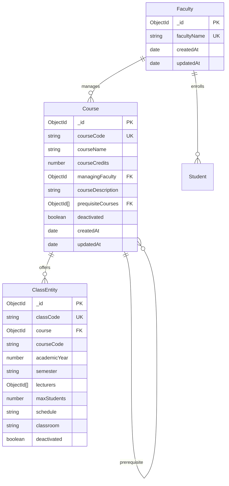
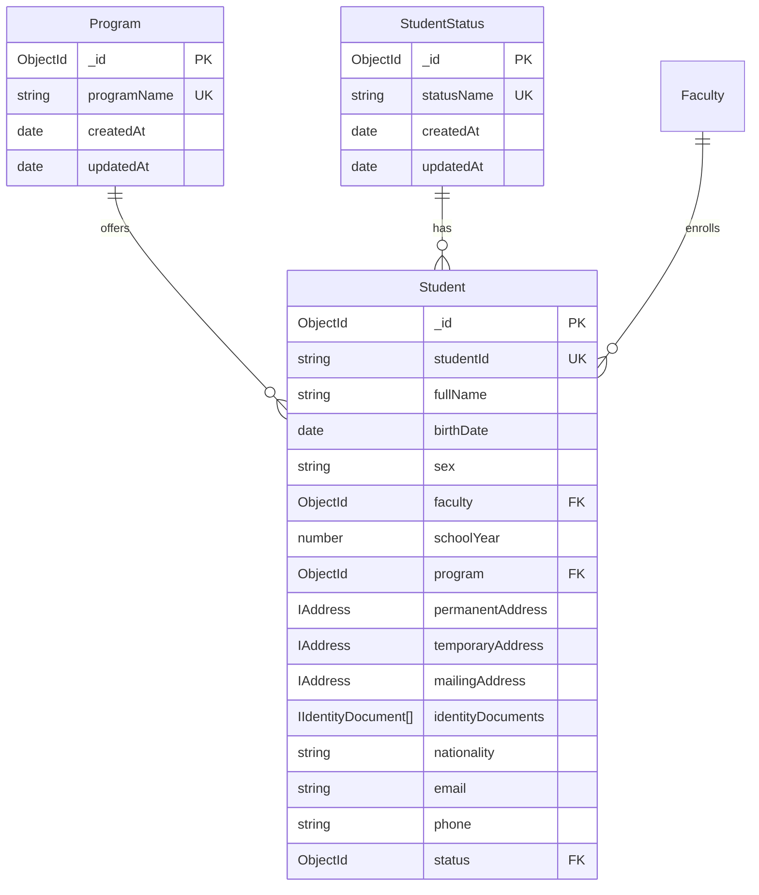
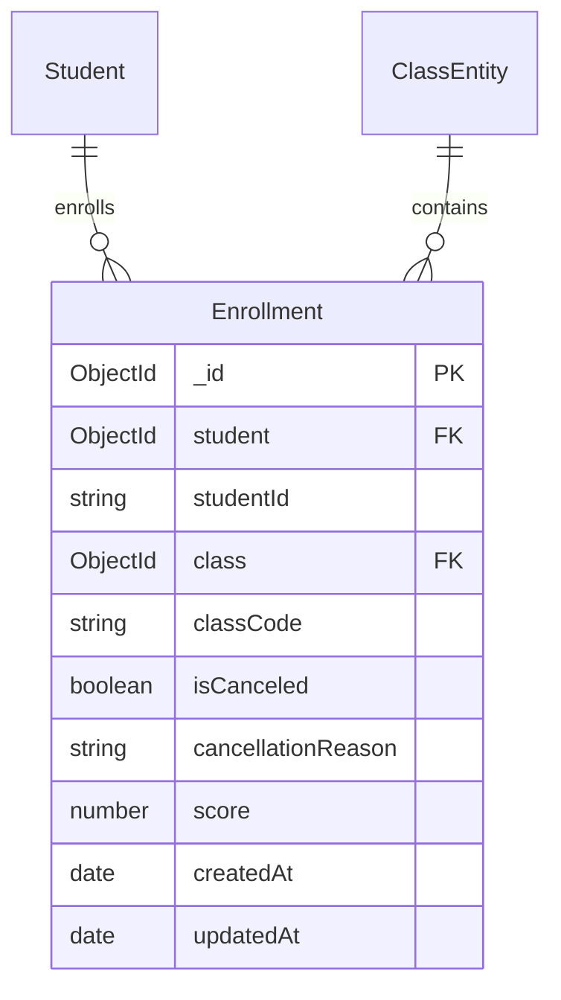

# Development Plan: Database Schema, Entity Updates, and Data Validation

## Overview

This document outlines the development plan to fulfill the first three requirements from the `requirements.txt`:

1. Database Schema Documentation
2. Updating an existing entity (How to add a new property)
3. Data Validation

## Current System Analysis

### Existing Models Structure

The backend currently has the following models:

- **Class** - Represents academic classes with course references, schedules, and enrollment limits
- **Course** - Core academic courses with credits, descriptions, and prerequisites
- **Enrollment** - Links students to classes with scoring and cancellation support
- **Faculty** - Academic faculties/departments
- **Program** - Academic programs offered by faculties
- **Student** - Student information with addresses, identity documents, and status
- **StudentStatus** - Student academic status types

### Database Technology Stack

- **Database**: MongoDB (NoSQL)
- **ODM**: Mongoose with TypeScript
- **Migration**: Custom migration system with `migrate-mongo`
- **Testing**: Vitest with MongoDB Memory Server

## Requirement 1: Database Schema Documentation

### 1.1 Current Schema Overview

#### Collections Relationships by Groups

**Course and Faculty Management**



**Student Management System**



**Enrollment System**



#### Schema Details by Collection

**Faculty Collection**

- `_id`: ObjectId (Primary Key)
- `facultyName`: String (Required, Unique)
- `createdAt`: Date (Auto-generated)
- `updatedAt`: Date (Auto-generated)

**Program Collection**

- `_id`: ObjectId (Primary Key)
- `programName`: String (Required, Unique)
- `createdAt`: Date (Auto-generated)
- `updatedAt`: Date (Auto-generated)

**StudentStatus Collection**

- `_id`: ObjectId (Primary Key)
- `statusName`: String (Required, Unique)
- `createdAt`: Date (Auto-generated)
- `updatedAt`: Date (Auto-generated)

**Course Collection**

- `_id`: ObjectId (Primary Key)
- `courseCode`: String (Required, Unique)
- `courseName`: String (Required)
- `courseCredits`: Number (Required, Min: 2)
- `managingFaculty`: ObjectId (Required, References Faculty)
- `courseDescription`: String (Required)
- `prequisiteCourses`: Array<ObjectId> (Optional, References Course)
- `deactivated`: Boolean (Optional, Default: false)
- `createdAt`: Date (Auto-generated)
- `updatedAt`: Date (Auto-generated)

**Student Collection**

- `_id`: ObjectId (Primary Key)
- `studentId`: String (Required, Unique)
- `fullName`: String (Required)
- `birthDate`: Date (Required)
- `sex`: String (Required)
- `faculty`: ObjectId (Required, References Faculty)
- `schoolYear`: Number (Required)
- `program`: ObjectId (Required, References Program)
- `permanentAddress`: IAddress (Optional)
- `temporaryAddress`: IAddress (Optional)
- `mailingAddress`: IAddress (Optional)
- `identityDocuments`: Array<IIdentityDocument> (Required)
- `nationality`: String (Required)
- `email`: String (Required, Validated)
- `phone`: String (Required)
- `status`: ObjectId (Required, References StudentStatus)

**Class Collection**

- `_id`: ObjectId (Primary Key)
- `classCode`: String (Required, Unique)
- `course`: ObjectId (Optional, References Course, Auto-populated)
- `courseCode`: String (Required, References Course by code)
- `academicYear`: Number (Required)
- `semester`: String (Required, Enum: "I", "II", "III")
- `lecturers`: Array<ObjectId> (Required, Currently empty)
- `maxStudents`: Number (Required)
- `schedule`: String (Required)
- `classroom`: String (Required)
- `deactivated`: Boolean (Optional, Default: false)

**Enrollment Collection**

- `_id`: ObjectId (Primary Key)
- `student`: ObjectId (Optional, References Student, Auto-populated)
- `studentId`: String (Required, References Student by ID)
- `class`: ObjectId (Optional, References Class, Auto-populated)
- `classCode`: String (Required, References Class by code)
- `isCanceled`: Boolean (Required, Default: false)
- `cancellationReason`: String (Optional)
- `score`: Number (Optional)
- `createdAt`: Date (Auto-generated)
- `updatedAt`: Date (Auto-generated)

### 1.2 Embedded Schema Types

**IAddress**

- `street`: String (Required) - Format: [House Number, Street Name]
- `ward`: String (Required) - Ward/Commune name
- `district`: String (Required) - District/Town name
- `city`: String (Required) - City/Province name
- `country`: String (Required) - Country name

**IIdentityDocument**

- `type`: String (Required, Enum: "cmnd", "cccd", "passport")
- `number`: String (Required)
- `issueDate`: Date (Required)
- `issuePlace`: String (Required)
- `expirationDate`: Date (Required)
- `hasChip`: Boolean (Required for CCCD only, Optional for others)
- `issueCountry`: String (Required for Passport only, Optional for others)
- `notes`: String (Required for Passport only, Optional for others)

### 1.3 Field-Specific Requirements

#### Address Type Variations

The system supports three types of addresses with identical structure but different purposes:

- **Permanent Address**: Student's official permanent residence
- **Temporary Address**: Student's current temporary residence (if different from permanent)
- **Mailing Address**: Address for receiving official correspondence

#### Identity Document Type-Specific Fields

Based on the document type, certain fields have different requirements:

**CMND (Citizen Identity Card)**

- Required: `type`, `number`, `issueDate`, `issuePlace`, `expirationDate`
- Optional: All other fields

**CCCD (Citizen Identity Card with Chip)**

- Required: `type`, `number`, `issueDate`, `issuePlace`, `expirationDate`, `hasChip`
- Optional: `issueCountry`, `notes`

**Passport**

- Required: `type`, `number`, `issueDate`, `issuePlace`, `expirationDate`, `issueCountry`, `notes`
- Optional: `hasChip`

#### Unused/Future Properties

Some fields are currently defined but not actively used in the system:

**Class Collection - Unused Properties**

- `lecturers`: Array<ObjectId> - Currently empty, reserved for future lecturer assignment functionality
- `deactivated`: Boolean - Present but not used in current business logic

**Course Collection - Partially Used Properties**

- `deactivated`: Boolean - Defined but may not be fully implemented in all business flows

### 1.4 Migration System

- Uses `migrate-mongo` for database migrations
- Migration files follow timestamp naming: `YYYYMMDD-description.js`
- Each migration has `up()` and `down()` methods
- Current migrations create base collections with initial data

### 1.5 Database Naming Convention

The system follows a consistent naming strategy across collections and fields:

#### Collection Naming

- **PascalCase**: All collection names use PascalCase (e.g., `Faculty`, `StudentStatus`, `Course`)
- **Singular Forms**: Collection names are singular, not plural
- **Descriptive Names**: Names clearly indicate the entity type

#### Field Naming

- **camelCase**: All field names use camelCase (e.g., `studentId`, `courseCode`, `managingFaculty`)
- **Reference Fields**:
  - ObjectId references: Use the referenced entity name in camelCase (e.g., `faculty`, `program`)
  - String references: Use the referenced field name (e.g., `studentId`, `courseCode`)
- **Boolean Fields**: Use descriptive names with clear meaning (e.g., `deactivated`, `isCanceled`)
- **Date Fields**: Use descriptive suffixes (e.g., `createdAt`, `updatedAt`, `birthDate`)

#### Embedded Document Naming

- **Interface Prefix**: Use `I` prefix for TypeScript interfaces (e.g., `IAddress`, `IIdentityDocument`)
- **Nested Properties**: Follow camelCase for all nested properties

### 1.6 Data Export/Import System

The system includes comprehensive data transfer capabilities through the `studentTransferingController`:

#### Export Functionality

- **Multiple Formats**: Supports both JSON and XML export formats
- **Complete Data**: Exports all student records with full object structure
- **Timestamped Files**: Generated files include timestamp for version control
- **Content Type Headers**: Proper MIME types for download (`application/json`, `application/xml`)

#### Import Functionality

- **Format Detection**: Automatically handles JSON and XML content types
- **Data Validation**: Validates imported data structure before processing
- **Error Handling**: Tracks both successful imports and failed records with detailed error messages
- **Bulk Processing**: Processes multiple student records in a single operation

#### XML Structure Pattern

```xml
<?xml version="1.0" encoding="utf-8"?>
<students>
  <student>
    <studentId>2024CS001</studentId>
    <fullName>Student Name</fullName>
    <!-- ... other fields ... -->
  </student>
</students>
```

#### JSON Structure Pattern

```json
[
  {
    "studentId": "2024CS001",
    "fullName": "Student Name",
    "birthDate": "2000-01-01T00:00:00.000Z",
    "faculty": "ObjectId",
    "program": "ObjectId",
    "identityDocuments": [
      {
        "type": "cccd",
        "number": "123456789",
        "issueDate": "2018-01-01T00:00:00.000Z"
      }
    ]
  }
]
```

## Requirement 2: Updating an Existing Entity (Adding New Properties)

### 2.1 Process Overview

Adding new properties to existing entities requires careful planning to maintain data integrity, backward compatibility, and system functionality. This guide provides a comprehensive step-by-step process with real examples from the current system.

### 2.2 Complete Step-by-Step Process

#### Step 1: Plan the Change

**Before making any changes, consider:**

- Is this field required or optional?
- What should be the default value for existing records?
- Will this change affect existing API endpoints?
- Are there any validation requirements?
- Will this impact other parts of the system?

#### Step 2: Update the TypeScript Interface

**File Location**: `backend/src/models/[modelName].ts`

**Example**: Adding email verification to Student model

```typescript
// Before
export interface IStudent {
  studentId: string;
  fullName: string;
  birthDate: Date;
  // ...existing properties...
  email: string;
  phone: string;
  status: Types.ObjectId;
}

// After
export interface IStudent {
  studentId: string;
  fullName: string;
  birthDate: Date;
  // ...existing properties...
  email: string;
  emailVerified?: boolean; // NEW PROPERTY
  emailVerificationToken?: string; // NEW PROPERTY
  emailVerificationExpires?: Date; // NEW PROPERTY
  phone: string;
  status: Types.ObjectId;
}
```

#### Step 3: Update the Mongoose Schema

**Add the new fields to the schema with appropriate validation:**

```typescript
const studentSchema = new Schema<IStudent>(
  {
    // ...existing fields...
    email: { type: String, required: true },
    emailVerified: {
      type: Boolean,
      default: false,
      required: false,
    },
    emailVerificationToken: {
      type: String,
      required: false,
      validate: {
        validator: function (v: string) {
          // Only require token if email is not verified and user is new
          if (this.isNew && !v) {
            return false;
          }
          return true;
        },
        message: "Email verification token is required for new users",
      },
    },
    emailVerificationExpires: {
      type: Date,
      required: false,
      validate: {
        validator: function (v: Date) {
          // If token exists, expiration must also exist
          if (this.emailVerificationToken && !v) {
            return false;
          }
          return true;
        },
        message: "Expiration date required when verification token is present",
      },
    },
    phone: { type: String, required: true },
    // ...remaining fields...
  },
  { timestamps: true }
);
```

#### Step 4: Create Database Migration

**File Location**: `backend/src/migration/YYYYMMDD-description.js`

**File Name Example**: `20250621-add-email-verification-to-students.js`

```javascript
const { COLLECTION_NAMES } = require("../constants/collectionNames");

module.exports = {
  async up(db, client) {
    console.log("Adding email verification fields to students...");

    try {
      // Add new fields to all existing student documents
      const result = await db.collection(COLLECTION_NAMES.STUDENT).updateMany(
        {}, // Empty filter to update all documents
        {
          $set: {
            emailVerified: false, // Default to unverified
            emailVerificationToken: null, // No token initially
            emailVerificationExpires: null, // No expiration initially
          },
        }
      );

      console.log(`Updated ${result.modifiedCount} student documents`);

      // Optionally, create an index for the new field if needed for performance
      await db
        .collection(COLLECTION_NAMES.STUDENT)
        .createIndex({ emailVerified: 1 });

      console.log("Email verification index created");
    } catch (error) {
      console.error("Error in migration:", error);
      throw error;
    }
  },

  async down(db, client) {
    console.log("Removing email verification fields from students...");

    try {
      // Remove the added fields
      const result = await db.collection(COLLECTION_NAMES.STUDENT).updateMany(
        {},
        {
          $unset: {
            emailVerified: "",
            emailVerificationToken: "",
            emailVerificationExpires: "",
          },
        }
      );

      console.log(
        `Removed fields from ${result.modifiedCount} student documents`
      );

      // Remove the index
      await db
        .collection(COLLECTION_NAMES.STUDENT)
        .dropIndex({ emailVerified: 1 });

      console.log("Email verification index removed");
    } catch (error) {
      console.error("Error in rollback:", error);
      throw error;
    }
  },
};
```

#### Step 5: Run the Migration

**Execute the migration using migrate-mongo:**

```powershell
# Navigate to backend directory
cd backend

# Run the migration
npx migrate-mongo up

# Verify the migration was applied
npx migrate-mongo status
```

#### Step 6: Update API Controllers

**File Location**: `backend/src/controllers/studentController.ts`

**Add handling for new fields in create/update operations:**

```typescript
// Example: Update create student function
export const createStudent = async (req: Request, res: Response) => {
  try {
    const studentData = req.body;

    // Add default values for new fields if not provided
    if (studentData.emailVerified === undefined) {
      studentData.emailVerified = false;
    }

    // Generate verification token for new students
    if (!studentData.emailVerified) {
      studentData.emailVerificationToken = generateVerificationToken();
      studentData.emailVerificationExpires = new Date(
        Date.now() + 24 * 60 * 60 * 1000
      ); // 24 hours
    }

    const student = new Student(studentData);
    await student.save();

    res.status(201).json({
      success: true,
      data: student,
    });
  } catch (error) {
    res.status(400).json({
      success: false,
      message: error.message,
    });
  }
};

// Add new endpoint for email verification
export const verifyEmail = async (req: Request, res: Response) => {
  try {
    const { token } = req.body;

    const student = await Student.findOne({
      emailVerificationToken: token,
      emailVerificationExpires: { $gt: new Date() },
    });

    if (!student) {
      return res.status(400).json({
        success: false,
        message: "Invalid or expired verification token",
      });
    }

    student.emailVerified = true;
    student.emailVerificationToken = undefined;
    student.emailVerificationExpires = undefined;
    await student.save();

    res.status(200).json({
      success: true,
      message: "Email verified successfully",
    });
  } catch (error) {
    res.status(500).json({
      success: false,
      message: error.message,
    });
  }
};
```

#### Step 7: Update Routes

**File Location**: `backend/src/routes/studentRoute.ts`

```typescript
import { Router } from "express";
import {
  createStudent,
  verifyEmail, // NEW IMPORT
} from "../controllers/studentController";

const router = Router();

// Existing routes...
router.post("/", createStudent);

// NEW ROUTE
router.post("/verify-email", verifyEmail);

export default router;
```

#### Step 8: Update Repository Layer

**File Location**: `backend/src/repositories/studentRepository.ts`

```typescript
// Add new repository functions for email verification

export const findStudentByVerificationToken = async (
  token: string
): Promise<IStudent | null> => {
  return await Student.findOne({
    emailVerificationToken: token,
    emailVerificationExpires: { $gt: new Date() },
  });
};

export const updateEmailVerificationStatus = async (
  studentId: string,
  verified: boolean
): Promise<IStudent | null> => {
  return await Student.findByIdAndUpdate(
    studentId,
    {
      emailVerified: verified,
      $unset: verified
        ? {
            emailVerificationToken: "",
            emailVerificationExpires: "",
          }
        : {},
    },
    { new: true }
  );
};
```

#### Step 9: Update Tests

**File Location**: `backend/src/models/student.test.ts`

```typescript
import { describe, it, expect, beforeEach, afterEach } from "vitest";
import Student from "./student";

describe("Student Email Verification", () => {
  beforeEach(async () => {
    // Setup test data
  });

  afterEach(async () => {
    // Cleanup test data
  });

  it("should set emailVerified to false by default", async () => {
    const studentData = {
      studentId: "24000001",
      fullName: "Test Student",
      email: "test@student.edu.vn",
      // ...other required fields
    };

    const student = new Student(studentData);
    await student.save();

    expect(student.emailVerified).toBe(false);
  });

  it("should require verification token for new unverified students", async () => {
    const studentData = {
      studentId: "24000002",
      fullName: "Test Student 2",
      email: "test2@student.edu.vn",
      emailVerified: false,
      // Missing emailVerificationToken
    };

    const student = new Student(studentData);

    await expect(student.save()).rejects.toThrow(
      "Email verification token is required for new users"
    );
  });

  it("should allow verified students without verification token", async () => {
    const studentData = {
      studentId: "24000003",
      fullName: "Test Student 3",
      email: "test3@student.edu.vn",
      emailVerified: true,
      // No verification token needed
    };

    const student = new Student(studentData);
    await student.save();

    expect(student.emailVerified).toBe(true);
    expect(student.emailVerificationToken).toBeUndefined();
  });

  it("should validate token expiration relationship", async () => {
    const studentData = {
      studentId: "24000004",
      fullName: "Test Student 4",
      email: "test4@student.edu.vn",
      emailVerificationToken: "test-token",
      // Missing emailVerificationExpires
    };

    const student = new Student(studentData);

    await expect(student.save()).rejects.toThrow(
      "Expiration date required when verification token is present"
    );
  });
});
```

#### Step 10: Update Frontend (Optional)

**If the frontend needs to handle the new fields:**

```javascript
// Add email verification handling to student forms
const StudentRegistrationForm = () => {
  const [formData, setFormData] = useState({
    // ...existing fields
    email: "",
    emailVerified: false,
  });

  const handleEmailVerification = async (token) => {
    try {
      const response = await fetch("/api/students/verify-email", {
        method: "POST",
        headers: { "Content-Type": "application/json" },
        body: JSON.stringify({ token }),
      });

      if (response.ok) {
        // Handle successful verification
        setFormData((prev) => ({ ...prev, emailVerified: true }));
      }
    } catch (error) {
      console.error("Email verification failed:", error);
    }
  };

  // ...rest of component
};
```

#### Step 11: Update Documentation

**Update the database schema documentation to reflect the new fields:**

```markdown
## Student Collection Schema Updates

### New Fields Added (June 21, 2025)

| Field                      | Type    | Constraints              | Description                  |
| -------------------------- | ------- | ------------------------ | ---------------------------- |
| `emailVerified`            | Boolean | Optional, Default: false | Email verification status    |
| `emailVerificationToken`   | String  | Optional                 | Token for email verification |
| `emailVerificationExpires` | Date    | Optional                 | Token expiration timestamp   |

### Migration Applied

- Migration: `20250621-add-email-verification-to-students.js`
- All existing students set to `emailVerified: false`
- New API endpoint: `POST /api/students/verify-email`
```

### 2.3 Best Practices for Entity Updates

#### 2.3.1 Planning Phase

1. **Impact Analysis**: Assess how the change affects existing functionality
2. **Backward Compatibility**: Ensure existing code continues to work
3. **Data Migration Strategy**: Plan how to handle existing records
4. **API Versioning**: Consider if API changes require versioning

#### 2.3.2 Implementation Phase

1. **Make Fields Optional Initially**: Use optional fields (`field?: Type`) to avoid breaking existing code
2. **Provide Sensible Defaults**: Set appropriate default values in migrations
3. **Comprehensive Validation**: Add validation that doesn't break existing data
4. **Atomic Operations**: Use database transactions where possible

#### 2.3.3 Testing Phase

1. **Unit Tests**: Test new fields individually
2. **Integration Tests**: Test the complete flow with new fields
3. **Migration Testing**: Test both up and down migrations
4. **Backward Compatibility Tests**: Ensure existing functionality still works

#### 2.3.4 Deployment Phase

1. **Migration First**: Run migrations before deploying new code
2. **Rollback Plan**: Have a clear rollback strategy
3. **Monitoring**: Monitor for errors after deployment
4. **Documentation Updates**: Update all relevant documentation

### 2.4 Common Pitfalls and Solutions

#### 2.4.1 Breaking Changes

**Problem**: Adding required fields breaks existing code
**Solution**: Make fields optional initially, then make required in a future update

#### 2.4.2 Data Inconsistency

**Problem**: Some records have new fields, others don't
**Solution**: Use migrations to ensure all records have consistent structure

#### 2.4.3 Validation Conflicts

**Problem**: New validation rules conflict with existing data
**Solution**: Add conditional validation that considers existing data state

#### 2.4.4 Performance Impact

**Problem**: New indexes or queries slow down the system
**Solution**: Test performance with realistic data volumes, optimize queries

### 2.5 Real-World Example: Adding Course Prerequisites

Let's walk through a complete real-world example of adding a prerequisite validation system to courses:

#### Current State

```typescript
// Existing Course interface
export interface ICourse {
  courseCode: string;
  courseName: string;
  courseCredits: number;
  managingFaculty: Types.ObjectId;
  courseDescription: string;
  prequisiteCourses?: Types.ObjectId[]; // Already exists but no validation
}
```

#### Step 1: Enhanced Interface

```typescript
export interface ICourse {
  courseCode: string;
  courseName: string;
  courseCredits: number;
  managingFaculty: Types.ObjectId;
  courseDescription: string;
  prequisiteCourses?: Types.ObjectId[];
  prerequisitePolicy?: "strict" | "recommended" | "none"; // NEW
  minimumPrerequisitesRequired?: number; // NEW
}
```

#### Step 2: Schema Update

```typescript
const CourseSchema = new Schema<ICourse>({
  // ...existing fields...
  prerequisitePolicy: {
    type: String,
    enum: ["strict", "recommended", "none"],
    default: "recommended",
  },
  minimumPrerequisitesRequired: {
    type: Number,
    default: 0,
    min: 0,
    validate: {
      validator: function (v: number) {
        // Can't require more prerequisites than exist
        return v <= (this.prequisiteCourses?.length || 0);
      },
      message: "Minimum required cannot exceed total prerequisites",
    },
  },
});
```

#### Step 3: Migration

```javascript
// 20250621-add-prerequisite-policy-to-courses.js
module.exports = {
  async up(db, client) {
    await db.collection("courses").updateMany(
      {},
      {
        $set: {
          prerequisitePolicy: "recommended",
          minimumPrerequisitesRequired: 0,
        },
      }
    );
  },

  async down(db, client) {
    await db.collection("courses").updateMany(
      {},
      {
        $unset: {
          prerequisitePolicy: "",
          minimumPrerequisitesRequired: "",
        },
      }
    );
  },
};
```

#### Step 4: Business Logic Update

```typescript
// In enrollment validation
export const validatePrerequisites = async (
  studentId: string,
  courseCode: string
): Promise<{ valid: boolean; message?: string }> => {
  const course = await Course.findOne({ courseCode }).populate(
    "prequisiteCourses"
  );

  if (course.prerequisitePolicy === "none") {
    return { valid: true };
  }

  const studentEnrollments = await Enrollment.find({
    studentId,
    isCanceled: false,
    score: { $gte: 5 }, // Assuming 5 is passing grade
  }).populate("class");

  const completedCourses = studentEnrollments.map((e) => e.class.courseCode);
  const prerequisiteCodes = course.prequisiteCourses.map((p) => p.courseCode);

  const completedPrereqs = prerequisiteCodes.filter((code) =>
    completedCourses.includes(code)
  );

  const required = course.minimumPrerequisitesRequired || 0;

  if (completedPrereqs.length < required) {
    return {
      valid: false,
      message: `Missing ${
        required - completedPrereqs.length
      } required prerequisites`,
    };
  }

  if (
    course.prerequisitePolicy === "strict" &&
    completedPrereqs.length < prerequisiteCodes.length
  ) {
    return {
      valid: false,
      message: "All prerequisites must be completed for strict policy courses",
    };
  }

  return { valid: true };
};
```

This comprehensive guide provides a complete roadmap for safely adding new properties to existing entities while maintaining system integrity and functionality.

## Requirement 3: Data Validation

### 3.1 Current Validation Mechanisms

#### 3.1.1 Mongoose Built-in Validation

- **Required Fields**: Using `required: true`
- **Unique Constraints**: Using `unique: true`
- **Type Validation**: Automatic type checking
- **Number Ranges**: Using `min` and `max`
- **String Lengths**: Using `minlength` and `maxlength`
- **Enums**: Using predefined value sets

#### 3.1.2 Custom Validation Examples

**Reference Validation (Course exists)**

```typescript
courseCode: {
  type: String,
  required: true,
  validate: [
    {
      validator: async function (v: string) {
        const course = await mongoose.models[MODEL_NAMES.COURSE]
          .findOne({ courseCode: v }).exec();
        return !!course;
      },
      message: 'Course with code "{VALUE}" does not exist',
    },
  ],
}
```

**Faculty Reference Validation**

```typescript
managingFaculty: {
  type: Schema.Types.ObjectId,
  ref: MODEL_NAMES.FACULTY,
  required: true,
  validate: {
    validator: async function (v: Types.ObjectId) {
      const faculty = await mongoose.models[MODEL_NAMES.FACULTY]
        .findById(v).exec();
      return !!faculty;
    },
    message: 'Faculty with ID "{VALUE}" does not exist',
  },
}
```

### 3.2 Validation Strategy Enhancements

#### 3.2.1 Email Validation

```typescript
email: {
  type: String,
  required: true,
  unique: true,
  lowercase: true,
  validate: {
    validator: function(v: string) {
      return /^[^\s@]+@[^\s@]+\.[^\s@]+$/.test(v);
    },
    message: 'Invalid email format'
  }
}
```

#### 3.2.2 Phone Number Validation

```typescript
phone: {
  type: String,
  required: true,
  validate: {
    validator: function(v: string) {
      // Vietnamese phone number format
      return /^(\+84|84|0)[1-9][0-9]{8,9}$/.test(v.replace(/\s/g, ''));
    },
    message: 'Invalid Vietnamese phone number format'
  }
}
```

#### 3.2.3 Student ID Validation

```typescript
studentId: {
  type: String,
  required: true,
  unique: true,
  validate: {
    validator: function(v: string) {
      // Format: YYYY + Faculty Code + Sequential Number
      return /^[0-9]{4}[A-Z]{2,3}[0-9]{4,6}$/.test(v);
    },
    message: 'Student ID must follow format: YYYY[Faculty][Number]'
  }
}
```

#### 3.2.4 Date Range Validation

```typescript
birthDate: {
  type: Date,
  required: true,
  validate: {
    validator: function(v: Date) {
      const now = new Date();
      const age = now.getFullYear() - v.getFullYear();
      return age >= 16 && age <= 80; // Reasonable age range
    },
    message: 'Birth date must represent an age between 16 and 80 years'
  }
}
```

### 3.3 Pre-save Middleware for Complex Validation

```typescript
StudentSchema.pre("save", async function (next) {
  // Validate identity document consistency
  if (this.identityDocuments.length === 0) {
    throw new Error("At least one identity document is required");
  }

  // Ensure unique identity document numbers
  const numbers = this.identityDocuments.map((doc) => doc.number);
  if (new Set(numbers).size !== numbers.length) {
    throw new Error("Identity document numbers must be unique");
  }

  // Validate address completeness if provided
  const addresses = [
    this.permanentAddress,
    this.temporaryAddress,
    this.mailingAddress,
  ].filter((addr) => addr !== undefined);

  for (const address of addresses) {
    if (
      !address.street ||
      !address.ward ||
      !address.district ||
      !address.city
    ) {
      throw new Error("Address must include street, ward, district, and city");
    }
  }

  next();
});
```

### 3.4 Input Sanitization

#### 3.4.1 String Sanitization

```typescript
// Remove dangerous characters and trim
const sanitizeString = (str: string): string => {
  return str.trim()
    .replace(/[<>]/g, '') // Remove potential HTML tags
    .substring(0, 255); // Limit length
};

// Apply in schema transform
fullName: {
  type: String,
  required: true,
  set: sanitizeString
}
```

#### 3.4.2 Validation Error Handling

```typescript
// Custom error handler for validation
const handleValidationError = (error: mongoose.Error.ValidationError) => {
  const errors: { [key: string]: string } = {};

  for (const field in error.errors) {
    errors[field] = error.errors[field].message;
  }

  return {
    type: "ValidationError",
    message: "Data validation failed",
    errors,
  };
};
```

## Implementation Timeline

### Phase 1: Documentation (Week 1)

- Complete database schema documentation
- Document current validation rules
- Create entity relationship diagrams

### Phase 2: Entity Update Framework (Week 2)

- Create standardized process for adding properties
- Develop migration templates
- Update testing frameworks for new properties

### Phase 3: Enhanced Validation (Week 3)

- Implement comprehensive validation rules
- Add input sanitization
- Create validation error handling system

### Phase 4: Testing and Documentation (Week 4)

- Comprehensive testing of all validation rules
- Update API documentation
- Create developer guidelines

## Tools and Technologies Required

- **Mongoose**: ODM for MongoDB with TypeScript support
- **migrate-mongo**: Database migration management
- **Vitest**: Unit testing framework
- **MongoDB Memory Server**: In-memory database for testing
- **Joi/Zod** (Optional): Additional validation library for complex rules
- **TypeScript**: Type safety and interface definitions

## Success Criteria

1. **Complete Schema Documentation**: All collections, relationships, and validation rules documented
2. **Standardized Update Process**: Clear procedure for adding properties with migration support
3. **Comprehensive Validation**: All data inputs validated with appropriate error messages
4. **Maintainable Codebase**: Clear separation of concerns and reusable validation patterns
5. **Test Coverage**: All validation rules covered by unit tests

This plan provides a structured approach to implementing the first three requirements while maintaining code quality and system reliability.
